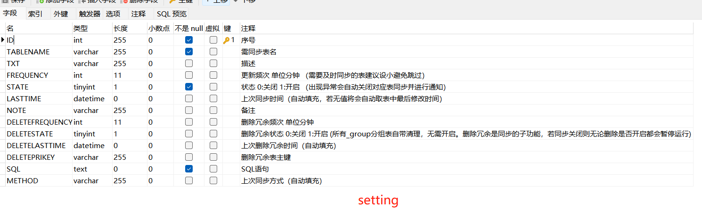
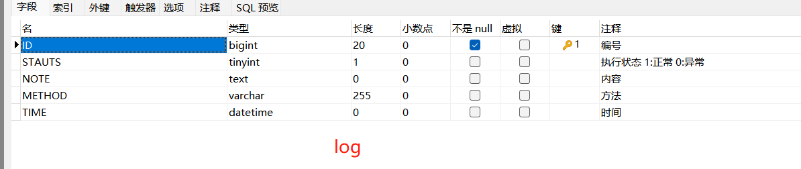

# Kindgee-k3cloud-DataSynchronization
金蝶云星空定时服务插件数据同步（C#）


本示例通过编写金蝶二次开发服务插件将金蝶内部 SQLServer 数据同步至外部 Mysql 数据库中，便于其他需求进行调用。使用前须在Mysql数据库中新建一张setting表与一张log表，表结构如下：






本例有两种查询条件存放方式，一是新建类在插件中存放，二是存放在Mysql数据库中便于修改。


SQL语句示例如下：

```sql
select a.FSUPPLIERID,a.FNumber, a.FPRIMARYGROUP as 'FGROUPID',f.FNAME as 'FPRIMARYGROUP',  a.FCreateOrgId,c.FNAME AS 'FCreateOrgNAME', a.FUseOrgId,
d.FNAME AS 'FUseOrgNAME',b.FNAME,b.FSHORTNAME,k.FDATAVALUE AS 'FCOUNTRY',
	l.FDATAVALUE AS 'FPROVINCIAL',e.FADDRESS,b.F_PINPAIWENBEN,h.FNAME as 'FPROVIDERID',i.FDATAVALUE as 'FSUPPLIERGR',
	a.FDOCUMENTSTATUS,a.FFORBIDSTATUS,
	a.FCREATEDATE,a.FMODIFYDATE
	from  T_BD_SUPPLIER a
INNER JOIN T_BD_SUPPLIER_L b on a.FSUPPLIERID = b.FSUPPLIERID
INNER JOIN T_ORG_ORGANIZATIONS_L c ON ( a.FCreateOrgId = c.FORGID AND c.FLOCALEID= '2052' )
LEFT JOIN T_ORG_ORGANIZATIONS_L d ON ( a.FUseOrgId = d.FORGID AND d.FLOCALEID= '2052' )
LEFT JOIN T_BD_SUPPLIERBASE e on a.FSUPPLIERID = e.FSUPPLIERID
LEFT JOIN T_BD_SUPPLIERGROUP_L f on (a.FPRIMARYGROUP = f.FID AND f.FLOCALEID= '2052' )
LEFT JOIN T_BD_SUPPLIERBUSINESS g on a.FSUPPLIERID = g.FSUPPLIERID
LEFT JOIN T_BD_SUPPLIER_L h on g.FPROVIDERID = h.FSUPPLIERID
LEFT JOIN T_BAS_ASSISTANTDATAENTRY_L i ON (e.FSUPPLIERGRADE = i.FENTRYID AND i.FLOCALEID= '2052' )
LEFT JOIN T_BAS_ASSISTANTDATAENTRY_L k ON (e.FCOUNTRY = k.FENTRYID AND k.FLOCALEID= '2052' )
LEFT JOIN T_BAS_ASSISTANTDATAENTRY_L l ON (e.FPROVINCIAL = l.FENTRYID AND l.FLOCALEID= '2052' )
where a.FMODIFYDATE >= '{0}' and a.FMODIFYDATE <= '{1}'
ORDER BY a.FMODIFYDATE desc
```

该处**{0}**与**{1}**作为占位符与日期进行拼接，可以实现分日期执行查询，避免一次查询数据量过多导致出现卡顿。详情请见代码。


另外在异常处理中加入了邮件提醒，如需使用该功能请先查看[开发文档](https://github.com/Taki0327/Secondary-Development-of-Kindgee-k3cloud)开启邮件虚拟账户。服务插件的发布与启用可一并参照。
