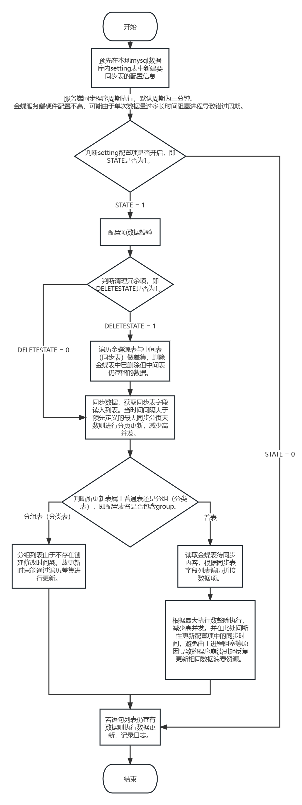

# Kindgee-k3cloud-DataSynchronization
金蝶云星空定时服务插件数据同步（C#）

## 配置说明

由于远程托管形式无法直连金蝶服务器数据库进行操作，本示例通过编写金蝶二次开发服务插件将金蝶内部 SQLServer 数据库通过定时推送的方式同步至外部 Mysql 数据库中，便于其他需求进行调用。

## 整体流程



使用前须在Mysql数据库中新建一张setting表与一张log表，表结构如下：


## 操作步骤

### 1.确立需求

在金蝶数据库中确立要同步的表与字段，并参照**金碟云星空集成开发平台**（使用安装步骤请参考[操作说明书](https://github.com/Taki0327/Secondary-Development-of-Kindgee-k3cloud)编写sql语句。

本例有两种查询条件存放方式，一是新建类在插件中存放，二是存放在Mysql数据库中便于修改。

SQL语句示例如下：

```sql
select a.FSUPPLIERID,a.FNumber, a.FPRIMARYGROUP as 'FGROUPID',f.FNAME as 'FPRIMARYGROUP',  a.FCreateOrgId,c.FNAME AS 'FCreateOrgNAME', a.FUseOrgId,
d.FNAME AS 'FUseOrgNAME',b.FNAME,b.FSHORTNAME,k.FDATAVALUE AS 'FCOUNTRY',
	l.FDATAVALUE AS 'FPROVINCIAL',e.FADDRESS,b.F_PINPAIWENBEN,h.FNAME as 'FPROVIDERID',i.FDATAVALUE as 'FSUPPLIERGR',
	a.FDOCUMENTSTATUS,a.FFORBIDSTATUS,
	a.FCREATEDATE,a.FMODIFYDATE
	from  T_BD_SUPPLIER a
INNER JOIN T_BD_SUPPLIER_L b on a.FSUPPLIERID = b.FSUPPLIERID
INNER JOIN T_ORG_ORGANIZATIONS_L c ON ( a.FCreateOrgId = c.FORGID AND c.FLOCALEID= '2052' )
LEFT JOIN T_ORG_ORGANIZATIONS_L d ON ( a.FUseOrgId = d.FORGID AND d.FLOCALEID= '2052' )
LEFT JOIN T_BD_SUPPLIERBASE e on a.FSUPPLIERID = e.FSUPPLIERID
LEFT JOIN T_BD_SUPPLIERGROUP_L f on (a.FPRIMARYGROUP = f.FID AND f.FLOCALEID= '2052' )
LEFT JOIN T_BD_SUPPLIERBUSINESS g on a.FSUPPLIERID = g.FSUPPLIERID
LEFT JOIN T_BD_SUPPLIER_L h on g.FPROVIDERID = h.FSUPPLIERID
LEFT JOIN T_BAS_ASSISTANTDATAENTRY_L i ON (e.FSUPPLIERGRADE = i.FENTRYID AND i.FLOCALEID= '2052' )
LEFT JOIN T_BAS_ASSISTANTDATAENTRY_L k ON (e.FCOUNTRY = k.FENTRYID AND k.FLOCALEID= '2052' )
LEFT JOIN T_BAS_ASSISTANTDATAENTRY_L l ON (e.FPROVINCIAL = l.FENTRYID AND l.FLOCALEID= '2052' )
where a.FMODIFYDATE >= '{0}' and a.FMODIFYDATE <= '{1}'
ORDER BY a.FMODIFYDATE desc
```


该处{0}与{1}作为占位符与日期进行拼接，可以实现分日期执行查询，避免一次查询数据量过多导致出现卡顿。详情请见代码。

##### **Tips：**

1. **编写时务必确保sql语句中字段名与金蝶原始表相对应**，若后期出现同步失败等问题务必检查sql与表对应是否正确。
2. 更新时分为**普通表**与**分类表**这两类（详见流程图），分类表用于某些数据中不含有**【最后修改时间】**(**FMODIFYDATE**)时间戳，或该时间戳不可靠（存在空值等特殊情况）。故采用双库表全量对比后增量更新的方式进行处理，可根据实际需要选择。分类表在使用过程中需要在公司库中的同步表名后缀加上 **group**，**setting表**内的**表名**也需要一并修改。**sql语句**中无需包含**FMODIFYDATE**字段，**where筛选条件**内也请**不要加入时间戳指代符**。
3. 若数据库中不存在直接表，可通过倒推方式询问实际操作的表集合，以此拼接。也可访问[金蝶云社区](https://vip.kingdee.com/?productLineId=1)尝试搜索。

### 2.同步配置

通过上步已经可以在本地的金蝶数据库中将想要的数据导出，下面将通过配置实现自动同步。

#### 创建同步（中间）表

根据上面需求确立的字段，在mysql数据库中新建一张同步表用以存储同步数据。

##### **Tips：**

1. **同步表的字段名称**请严格按照金蝶源表和sql语句中的字段名称。<u>理论上这三者的名称应该是相同的。</u>
2. 表**数据类型**请严格按照<u>金蝶源表数据类型</u>，尤其是**主键**。
3. 由于金蝶内部部分存储某某分类分组的表没有时间戳，无法确定其何时进行的修改。故在同步过程中采用金蝶端与本地端数据整体差集处理（参考流程图），在**定义表名称**时记得加上 **group** 作为标记。
4. 有时间戳记录何时修改的表在定义时不需要 group 标记，**但请务必确认时间戳字段的拼写是否正确**。如上图所示，除了不包含时间戳的数据表其余全都必须包含**创建时间(FCREATEDATE)与最后修改时间(FMODITYDATE)**这两个字段，**且这两个字段必须为大写**。服务端程序在执行过程中**判断内容是否更新依靠这两个字段**，请务必重视。
5. 表创建完后建议将**本地金蝶的数据先全部导入进去**，理论上该快照即是当时的数据。然后**将setting表中的上次同步时间(LASTTIME)修改为本地金蝶表中最后的修改时间**。若不进行该操作单纯依靠同步可能耗时巨大（数据量过大）。
6. 通常情况下程序出错的都是**sql语句与同步表的表定义**，若同步出现大量报错请务必检查。

### 3.setting表配置

金蝶服务端程序依靠本地mysql数据库中的setting表作为系统初始配置来源，且程序的运行与否均依靠setting表。

##### **Tips：**

1. 表配置项内容可参考过往创建的数据以及各字段注释描述。

2. 若数据量较大可能出现报错，可对照时间参考log日志表中报错信息与报错表名进行排错。

3. 由于金蝶服务端硬件资源较少，同步数据量过大时容易出现长时间阻塞，导致部分表无法同步或出现频繁报错。此时可优先关闭报错表的同步功能（**将该表STATE值改为0**）。检查如果没有其它错误可能性则可能由于数据量过大被金蝶系统自动杀掉了进程，这种报错无法避免，但理论上不会对现有数据及其他表造成影响，无需过于担心。程序不会崩溃也不会影响金蝶主系统，若时间允许的情况下可任由其自动执行至全部运行成功。

4. 如果出现数据未同步或同步有问题可将**上次修改时间(LASTTIME)**调整为要同步的时间之前，系统会自动从该时间往当前时间运行。

5. 所有包含group的表由于属于差集更新，无需开启冗余开关。

6. **非group表**的sql语句在存放至setting表字段中时**需要在where中加入**下方时间戳条件：

   ```sql
   where a.FMODIFYDATE >= '{0}' and a.FMODIFYDATE <= '{1}'
   ```

   a为sql语句中的字段名指代符，可根据实际情况修改。**不加该条件将会导致程序报错，同步失败。**

7. 删除冗余功能受同步开关限制，**且设置删除主键时也需与sql语句中的名称相同**（在程序中通过字符串处理拼接sql语句，故需要包含该完整主键名）。

8. 设置执行频率时请尽量**减少高并发**，尤其是全表遍历时由于数据量过多非常消耗资源，很容易被金蝶给杀掉或导致本地数据库执行缓慢引起大量报错。

9. 若需**修改服务端程序的执行周期**，请使用**administrator**账号登录金蝶网站，搜索并进入**执行计划**。插件名设置为：【插件项目名.类名，插件项目名】

### 4.日志

服务端程序在运行过程中除了每个周期会更新setting表中的更新时间，也会在一次执行周期结束后将成功更新的数据量及报错信息一起写入log表内。若出现报错，log表已包含服务端程序的报错信息，可参考该报错信息进行判断。

若log表无日志而setting表有报错记录，则可能由于程序分段执行时被系统给杀掉了，若时间允许的情况下可以等待其自动跑完。

另外在异常处理中加入了邮件提醒，如需使用该功能请先查看[开发文档](https://github.com/Taki0327/Secondary-Development-of-Kindgee-k3cloud)开启邮件虚拟账户。服务插件的发布与启用可一并参照。

### 5.未来发展方向
针对大批量数据可能导致单一运行进程阻塞的问题可增设守护进程进行轮片更新，尽量减少锁表锁库的影响。
